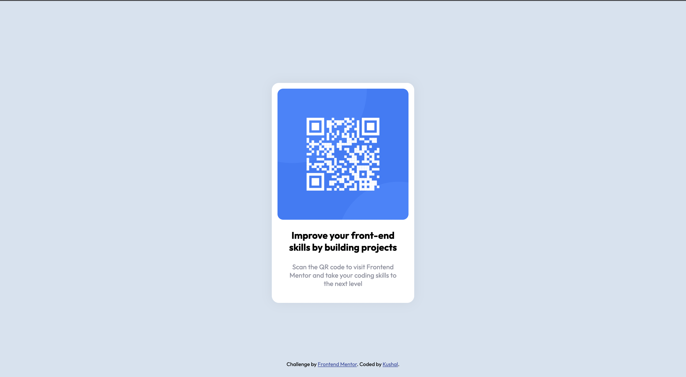

# Frontend Mentor - QR code component solution

This is a solution to the [QR code component challenge on Frontend Mentor](https://www.frontendmentor.io/challenges/qr-code-component-iux_sIO_H). Frontend Mentor challenges help you improve your coding skills by building realistic projects.

## Screenshot

Desktop Preview

Mobile Preview  

Solution URL: [Github](https://github.com/JarvisStriker/ui-practice-qr-code)

[Kushal](https://www.kushalst.com)
